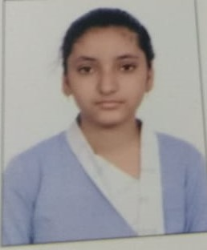

<html>
 <head>
  <title>My CV</title>
 </head>
 <body>
  <h1 style="color:green">Personal Details</h1>
  
  <ul> 
   <li><b>Name:</b>Anjali Gupta</li>
   <li><b>Father's Name:</b>Mr. Sanjay Gupta</li>
   <li><b>Mother's Name:</b>Mrs. Anjali Gupta</li>
   <li><b>Contact No.:</b>9528801766</li>
   <li><b>Hobbies:</b>
    <ol>
     <li>Sketching Birds</li>
     <li>Listening Songs</li>
    </ol>
   </li>
  </ul>
  

  <h1 style="color:navy">Educational Details</h1>
  <table border="2px" style="border-color:orange">
   <tr>
    <th>Education</th>
    <th>Status</th> 
    <th>Percentage/CGPA</th>
    <th>Passing Year</th> 
    <th>School/College</th> 
   </tr>
   <tr>
    <td><b>Class 10th</b></td>
    <td>Passed</td>
    <td>89%</td>
    <td>2018</td>
    <td>Meerut Public School (For Girls)</td>
   </tr> 
   <tr>
    <td><b>Class 12th</b></td>
    <td>Passed</td>
    <td>96.5%</td>
    <td>2020</td>
    <td>Meerut Public School (For Girls)</td>
   </tr>
   <tr>
    <td><b>B.TEch</b></td>
    <td>Pursuing(2ndYear)</td>
    <td> </td>
    <td>2024</td>
    <td>Meerut Institute of Engineering and Technology</td>
   </tr>
  </table>
